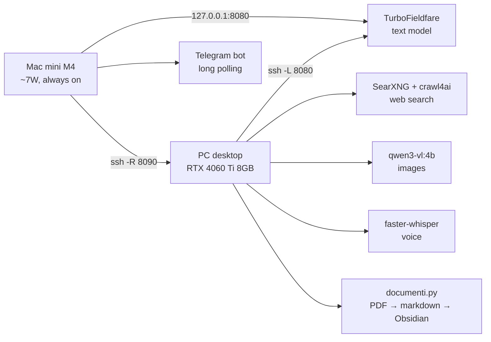

[Versione italiana](README.it.md)

# Elechim

A personal assistant that runs entirely on two home machines: a Mac mini hosts
the text model and Telegram bot, a PC does the heavy lifting. The model never
sees your documents.

## Why it's different

Most "local AI" projects put the model in front of everything. Elechim does the
opposite, because the numbers forced it there:

- **The model never reads the documents.** An 80-page PDF is 40-70K tokens. The
  Mac context window is 65,536 tokens, and prefill at 23 tok/s would cost 35-50
  minutes. So the PC extracts everything deterministically and the Mac only sees
  a ~300-token summary plus a handle.
- **The cache is the architecture.** TurboFieldfare's prompt cache has **one
  slot**. A single extra message, one changed tool definition, or one injected
  memory mid-conversation invalidates it. First turn ~7s; later turns ~2s with
  95% cache. Everything — Telegram and CLI sharing the same DB, voice and images
  turned into text before touching the conversation, frozen system prompt — is
  downstream of that number.
- **Tables never go near an LLM.** On a sample statistics PDF the old detector
  found **42 "tables" on 10 pages**, 26 of them false positives; adding a
  minimum digit density cut the false positives to **13**. The tables that
  survive are kept verbatim, because a 4B model will quietly turn 180 into 150.
- **Silence is the worst failure mode.** A scanned PDF used to extract 3
  characters against 3,610 and say nothing. Now `classifica()` measures median
  characters per page and rejects anything below 100, writing the reason next to
  the file.

## Topology



A single SSH tunnel from the PC handles both directions: `-L 8080` reaches the
model, `-R 8090` exposes the PC's tool gateway to the Mac. The reverse forward is
opened by the PC on purpose: when the PC sleeps, port 8090 disappears and the
bot gets an immediate refusal instead of a 30-second hang.

## What works

- **Conversational assistant** on Telegram and CLI, sharing the same SQLite
  conversation.
- **Web search** (`cerca`) that opens the top three result pages and extracts
  relevant passages, capped at ~1,400 characters, with no LLM in the loop.
- **Voice messages** via `faster-whisper large-v3` (~1.6 GB VRAM, 0.3-0.6 s hot).
- **Images** via `qwen3-vl:4b` (~3.5 GB), resized to 1536 px before inference.
- **Fast document lane**: a text-layer PDF goes from `documenti/in/` to
  Obsidian notes without any model touching the content. Measured on
  `DSML.pdf`: **533 pages, 70 seconds, 223 sections**.
- **Power management**: the PC suspends after three hours of inactivity; the Mac
  wakes it with a magic packet when a tool is needed.
- **`/gioco` and `/amici`**: manually unload/reload vision and whisper models so
  gaming fits in the same 8 GB of VRAM.

## What doesn't work yet

- **Scanned PDFs** are rejected honestly, not OCR'd.
- **Figures and diagrams** are not extracted yet (`90-Allegati/` is empty).
- **Atomic notes** are still bookmarks with truncated excerpts; `sbobina.py` is
  green on synthetic tests but has not run on real documents.
- **No cross-conversation memory**: conversations are archived, but phase 3
  (Honcho + embeddings) has not started.
- The pipeline can still miss **text-only table headers** that fall under the
  digit-density threshold.

## Hardware requirements

This is not a generic cloud project. It is built for exactly two machines:

- **Mac mini** (M4, 16 GB, headless): runs TurboFieldfare serving the text model
  and the Telegram bot. Always on (~7 W).
- **PC with a GPU** (here: RTX 4060 Ti 8 GB, 62 GB RAM, Fedora): runs the
  gateway, web search, vision, whisper, document pipeline, and Obsidian writer.
  Sleepable.

With vision and whisper loaded the GPU sits at **7,717 MiB out of 8,188**
(94%). There is no headroom for another model without staging work.

## Installation

### Prerequisites

- Python 3.12 (3.14 is too new for the ML stack).
- ollama, for the vision model (`qwen3-vl:4b`).
- podman, for SearXNG and crawl4ai quadlets.
- ffmpeg, for voice messages.
- poppler (`pdftotext`), for the fast document lane.

### 1. Environment and dependencies

```bash
python -m venv .venv
.venv/bin/pip install -r requirements.txt
```

### 2. Configuration

```bash
cp .env.example .env
cp mac/.env.example mac/.env
cp crawl4ai.env.example crawl4ai.env
cp searxng/settings.yml.example searxng/settings.yml
```

Fill in the placeholders. On the PC: `TELEGRAM_TOKEN` from @BotFather,
`TELEGRAM_ALLOWED_IDS`, `MAC_BASE_URL` and `MAC_MODEL`. On the Mac (`mac/.env`):
the same, but local `MAC_BASE_URL`, `GATEWAY_URL` pointing to the PC gateway,
and **`PROPRIETARIO`** (the name the model uses for you). `PROPRIETARIO` lives in
`.env`, not in code, because `mac/core.py` is public and the system prompt is the
prefix of the prompt cache: changing a single word would invalidate the prefill
of every live conversation.

The first chat ID that sends `/start` becomes the owner; all others are
ignored.

### 3. Models

On the PC:

```bash
ollama pull qwen3-vl:4b
```

The text model (e.g., `gemma-4-26b-a4b-it`) runs on the Mac and is served at
`MAC_BASE_URL`.

### 4. Start services

```bash
systemctl --user start elechim-gateway crawl4ai searxng
```

For manual testing: on the PC run `.venv/bin/python gateway.py`, then on the Mac
run `.venv/bin/python bot.py`.

### 5. Verify

Run `verifica_avvio.py` after starting services.

## Built on

*This list was verified from the code on 2026-08-16 — real imports, listening ports, invoked binaries — not from memory.*

### Running today

| Component | What it does here |
|---|---|
| **TurboFieldfare** (`127.0.0.1:8080`) | The model server on the Mac mini. Its single-slot prompt cache is the constraint that shapes half the architecture. |
| **ollama** (`127.0.0.1:11434`) | Models on the PC: `qwen3-vl:4b` for images, `qwen3:8b` for summarization. |
| **SearXNG** (`127.0.0.1:8888`) | Local metasearch — finds the pages. |
| **crawl4ai** (`127.0.0.1:11235`) | Downloads and extracts pages. |
| **trafilatura** + **requests** | The static fallback lane. |
| **faster-whisper** (`large-v3`) | Telegram voice messages. |
| **poppler** | `pdftotext`, `pdfinfo`, `pdftohtml`, `pdfimages`, `pdftoppm`: the entire fast document lane. |
| **pypdf** | Reads the embedded PDF outline, which beat every font heuristic. |
| **Obsidian** | The vault where notes land. |
| **Syncthing** | Document queue between the machines. |
| **podman** (quadlet) + **systemd** | Services and surviving reboots. |
| **ffmpeg** | Audio. |

Models: `gemma-4-26b-a4b-it` (Mac), `qwen3-vl:4b` and `qwen3:8b` (PC), `whisper large-v3`.

### Ideas borrowed

- **[SurfSense](https://github.com/MODSetter/SurfSense)** (Apache 2.0) — not adopted, but its hybrid search convinced us that **Reciprocal Rank Fusion** was the right way to merge three archives. `fusione.py` is our own implementation of the public algorithm, not their code.
- **RRF**, Cormack, Clarke, Buettcher (2009) — twenty lines that solve the problem of fusing scores that are not directly comparable.
- **Honcho** — the user model for phase 3, not yet integrated.
- **docling** — candidate for the second document lane, not yet used.
- **Khoj** and the various "second brain" projects — useful for understanding what we did **not** want: the model reading the documents.

### Built with

**opencode** and **Claude Code**, in a precise and limited role here: architects and builders, never laborers. They see the code, the logs, and the metrics; **never** the content of a document or a conversation.

## Roadmap

No dates. What is missing is stated plainly.

- **Phase 4, the rest**: figure extraction (`90-Allegati/` is empty; vector figures need `pdftocairo`); **docling** as a second lane for scans, which are currently rejected honestly but not read; **handwritten note photos**, where `qwen3-vl` is already in house.
- **Real-document summarization**: `sbobina.py` exists and is green on synthetic tests, but has not run on a full real book yet.
- **Phase 3, memory**: Postgres+pgvector, `bge-m3`, Honcho for personal facts — dated, superseded, and never deleted. `fusione.py` (RRF) is already waiting. **Under evaluation: start with full-text search and add vector search only where that fails**, instead of the other way around.
- **The four final tools** (`cerca`, `leggi`, `ricorda`, `salva`), to be applied **all at once and only once**, because touching the definitions invalidates the cache of every conversation.
- **Dreaming mode**: event-driven overnight consolidation, not clock-driven — connections across sources, contradictions, and forgetting as *date and supersede*, never delete.
- **Smarter sleep**: today the PC only watches desk idleness, not work in progress.

## License

MIT License — see [LICENSE](LICENSE). Copyright (c) 2026 Elechim.
